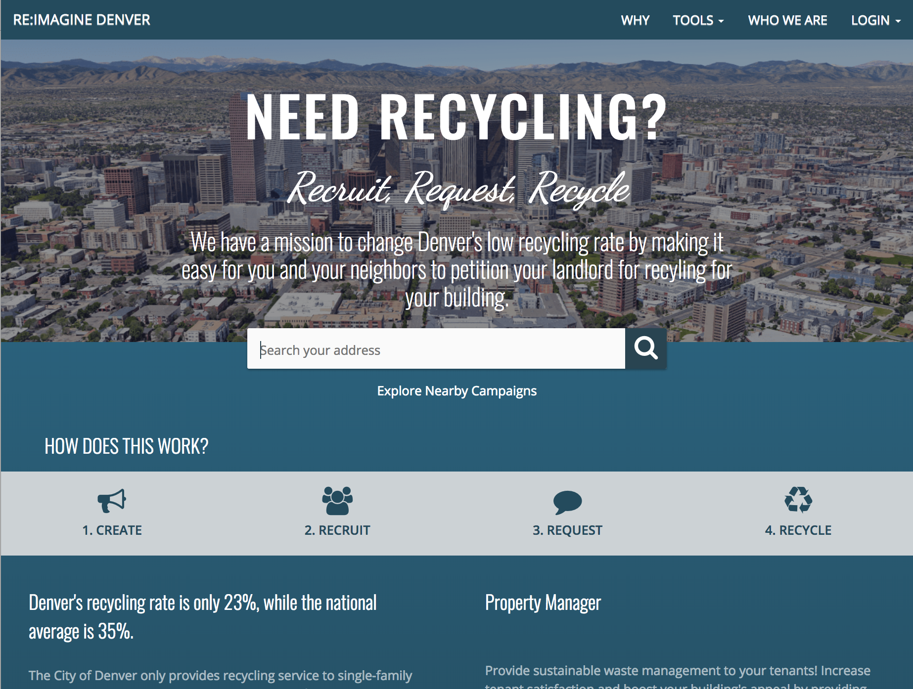

# Denver Re:Imagine
Denver recycles 20% and composts 2%. Leading cities like San Fransisco are diverting as high as 80% while Denver is falling behind with diverting ~22%.

Denverites believe they can do better! As a tenant in a Denver Multi-Family Complex (MFC) with 8 or more units, your property manager or landlord is NOT required to provide recycling or composting waste services. Many tenants in Denver have resorted to illegally dumping their recyclables in a neighbor’s recycling dumpster, or driving out of their way to a transfer station or parent’s home.

It’s time to organize and request better waste services from property managers in Denver. There’s power in numbers, by participating and gathering momentum with the Denver Recycling Request tool, property managers know this is important to you and your neighbors.



## Install Dependencies

1. Install [node 8.3](https://nodejs.org/) and [yarn 1.2.1](https://yarnpkg.com)
2. Clone the repo
3. Run `yarn install` in the root of the repo
4. create a client/.env.development file by getting one from another developer or getting keys for
    - REACT_APP_apiKey
    - REACT_APP_authDomain
    - REACT_APP_databaseURL
    - REACT_APP_projectId
    - REACT_APP_storageBucket
    - REACT_APP_messagingSenderId
5. you will need to use a personal Google Maps API key for your local environment, to get one visit [Google Maps API Key](https://developers.google.com/maps/documentation/javascript/get-api-key)
6. create a client/.env.local file and add a line like below
    - REACT_APP_GOOGLE_MAPS_KEY=<GOOGLEKEY>

## Local Development

Run `yarn dev` in the root directory to run the server and client with live reloading

## Linting
Run `yarn lint -- --fix` in the root repo.

It is highly recommended that you configure your editor to display eslint errors

## Debugging instructions for Node
1. Kill your server
2. Open package.json in the root
3. Within "scripts", and within the key of "start", add `--inspect` so that the line looks like "start": "node --inspect backend/index.js"
4. In the node file you want to debug, add a `debugger`
5. Open a new tab in your terminal, and run the backend server separately with `yarn start`
6. Start your frontend server again with `yarn dev`
7. Open a new tab in your browser, and navigate to [Chrome's inspect page](chrome://inspect)
8. On the Chrome inspect page, click "Open dedicated DevTools for Node"
9. Perform the function in your app running locally and you should hit your debugger
10. You can then play around in the debugger in your inspect window!

## Checkout the database
We use Firebase to host our dev and production databases so even when we are running our servers locally, we're all sharing the same remote development database. If you need access to the database, ask Matt, Jasmin or Katie for auth privileges to our Firebase database so that we can add you as a collaborator.

## End to End testing with cypress
In order to run and develop cypress tests, first run:
```sh
yarn test-dev
```
This spins up the app with an in-memory mongodb.

Then run:
```sh
yarn cypress open
```
This will open the cypress GUI for selecting and running tests. From here you can run the `example_spec` which is a demo of all the cypress functionality, or you can run other tests developed against specifically for this project.

Tests are written in the [cypress/integration](cypress/integration) directory.
